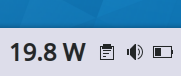
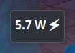
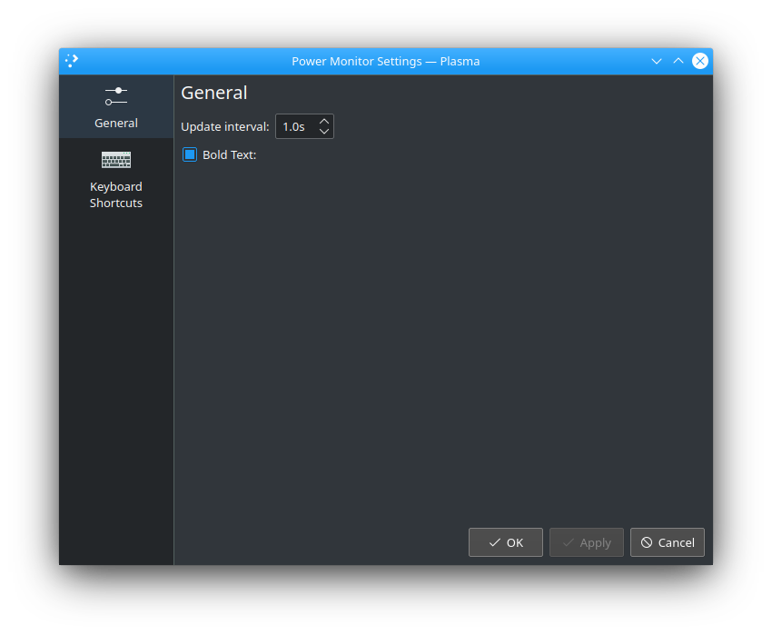

# Power Monitor
A stupidly simple KDE Plasma 5 widget to monitor the power consumption of your CPU in real time.

## Preview

## Installation
There are two ways to install this widget in your KDE Plasma.

1. Head over to the Plasma Add-On installer by going to: `Right click on Desktop -> Add Widgets -> Get New Widgets -> Search and Install this Widget`.
2. Download the `powerMonitor.plasmoid` file shared in this repo's [release section](https://github.com/atul-g/plasma-power-monitor/releases/tag/v0.1) or from the widget's KDE Store [link](https://www.pling.com/p/1466838/). After this, you can just do this: `Right Click on Desktop -> Add Widgets -> Install from local file -> Point to the downloaded package.plasmoid file`.

## Customization
As of now there are only two configuration settings; To make the text bold and to alter the update interval of the widgets:  

### Note
1. The widget displays power consumption in Watts.
2. This widget makes use of the `/sys/class/powercap/intel-rapl:0/energy_uj` file to query the energy consumption. If the widget displays "0.0 W", then you either 
    * don't have this file in your Linux Distribution, or
    * don't have the permission to read the said file.
3. If later is the case, try running `sudo chmod 444 /sys/class/powercap/intel-rapl:0/energy_uj` in konsole and see if the issue is fixed.
4. The power usage rises continously when the laptop is plugged in to A/C power. It is normal if you see high readings.
5. This will only work for Intel CPUs.
